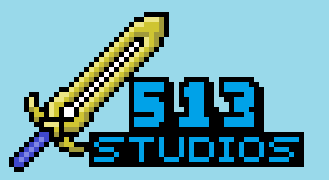

#513 Studios 

# Dread
A 2D sci-fi shooter. This is the readme file for the entire game.

This is a project from Cthe University of Idaho remote campus in Coeur d'Alene, Idaho.  
 
The current release, v1.0.0  
 

## Quick Launch
-------------------
- Double Click the dread.exe file and it will launch. 
- Click "Play Game" to play the game. 
- Click "Quit" to quit the game and close the application. 
- To pause the game and access the pause menu and help screen press 'esc' 
  - To quit the game from the pause menu click on "quit"
  - To resume the game click on "resume" 
 

## Cloning The Git Repository
-------------------
- On GitHub.com, navigate to the main page of the repository. 
- Above the list of files, click "Code"  
- Copy the URL for the repository.  
- Open Git Bash on Windows or Open a Terminal on Linux  
- Change the current working directory to the location where you want the cloned directory.  
- Type git clone, and then paste the URL you copied earlier.  
- Press Enter to create your local clone.  
 

## Installing Unity
-------------------
- Go to Unity’s Download Page and click “Download Installer for Windows”. You want to download version 2021.3.8f1 LTS. A UnityDownloadAssistant-3.8.exe file should be downloaded to your "downloads" folder (where 3.8 is the current Unity version). 
- Open the downloaded installer  
- Accepts the license and terms and click Next. 
- Select the components you would like to be installed with Unity and       click “Next”. Note: If you ever want to change the components, you can     re-run the installer. 
- You can change where you want Unity installed, or leave the default       option and click “Next”. 
- Depending on the components you selected, you may see additional prompts    before installing. Follow the prompts and click“Install”. Installing      Unity may take some time. After the installation is finished, Unity        will be installed on your computer.  
 

## Compiling the Code and Building the Game
-------------------
- If the code is changed, you will need to recompile the code and rebuild the game.  
- Open the unity editor and load the Pong project
- Unity will auto import and compile the code you changed from Visual Studio or VS Code.  
- As long as Unity doesn't generate any compilation errors, you can move onto building.  
- Click on "file" in the top left corner of the unity editor, then click "Build & Run".  
- Unity will automatically compile everything into the necessary files and create one convenient Pong application file that you can click on whenever you would like to   play. Note Unity creates several other files and folders that must be in the same directory of the Pong application for the game to run.  
 

<!-- ## Future Improvements
---------------------
-  -->
